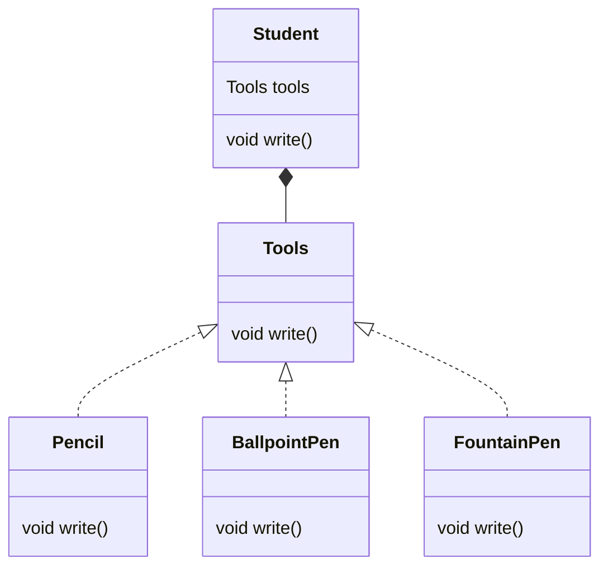

> 다양한 알고리즘을 각각의 클래스로 캡슐화하여 하나의 추상적인 접근점에 위임, 클라이언트가 적절한 전략을 취사 선택하여 로직을 수행할 수 있는 패턴



## Ex. 필기도구 선택

### Tools

```java
public interface Tools{
	public void write();
}
```

### Pencil

```java
public class Pencil implements Tools{
	@Override
	public void write(){
		System.out.println("By pencil");
	}
}
```

### BallpointPen

```java
public class BallpointPen implements Tools{
	@Override
	public void write(){
		System.out.println("By BallpointPen");
	}
}
```

### FountainPen

```java
public class FountainPen implements Tools{
	@Override
	public void write(){
		System.out.println("By FountainPen");
	}
}
```

### Student

```java
public class Student{
	private Tools tools;

	public void change(Tools tools){
		this.tools = tools;
	}

	public void write(){
		if(tools == null){
			System.out.println("without tools");
		}else{
			tools.write();
		}
	}

}
```

### Main

```java
public class Main{
	public static void main(String[] args){
		Student student = new Student();
		student.write();   //without tools

		student.change(new Pencil());
		student.write();   //by pencil

		student.change(new BallpointPen());
		student.write();   //by ballpointpen
	}
}
```

---

> 장점- 확장성
> {: .prompt-info }
