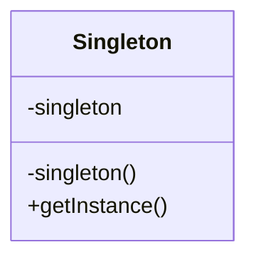

## 싱글톤 패턴

> 클래스의 인스턴스가 단 하나임을 보장하면서, 해당 인스턴스로의 접근 방법을 제공하는 패턴



### Singleton.class

```java
public class Singleton{
	private static Singleton singleton = new Singleton();
	private Singleton(){
		System.out.println("only one");
	}
	public static Singleton getInstance(){
		return singleton;
	}
}

```

### Main.class

```java
public class Main {
	public static void main(String[] args){
		Singleton instance1 = Singleton.getInstance();
		Singleton instance2 = Singleton.getInstance();

		System.out.println(instaince1 == instance2); //true
	}
}
```
