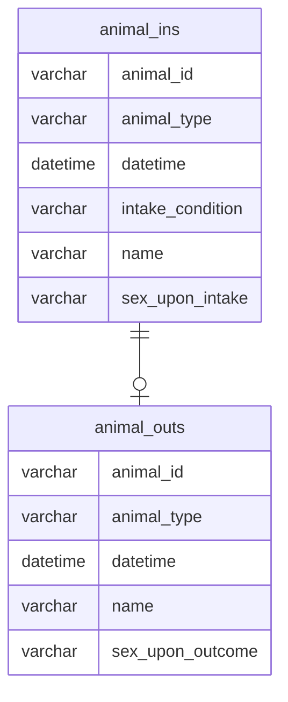

---
categories:
  - RDBMS
  - SQL-Practice
tags:
  - mysql
  - sql함수
mermaid: true
title: 프로그래머스 - Animal shelter 모음
permalink: /database/sql-practice/programmers-1
---



- 모든 레코드 조회하기

```sql
SELECT *
from animal_ins
order by animal_id;
```

- 동물의 아이디와 이름

```sql
SELECT animal_id, name
from animal_ins
order by animal_id;
```

- 이름이 있는 동물의 아이디 #is_not_null

```sql
 SELECT animal_id
from animal_ins
where name is not null
order by animal_id;
```

- 이름이 없는 동물의 아이디 #is_null

```sql
SELECT animal_id
from animal_ins
where name is null
order by animal_id;
```

- 역순 정렬하기 #desc

```sql
SELECT name, datetime
from animal_ins
order by animal_id desc;
```

- 아픈 동물 찾기

```sql
SELECT animal_id, name
from animal_ins
where intake_condition = 'sick';
```

어린 동물 찾기

```sql
SELECT animal_id, name
from animal_ins
where intake_condition != 'aged';
```

- 여러 기준으로 정렬하기

```sql
SELECT animal_id, name, datetime
from animal_ins
order by name, datetime desc;
```

- 최댓값 구하기 #max #alias

```sql
SELECT max(datetime) as 시간
from animal_ins
order by datetime;
```

- 상위 n개 레코드 #subquery

```sql
SELECT name
from animal_ins
where datetime = (select min(datetime)
		from animal_ins)  
order by datetime ;
```

- 동물 수 구하기 #count

```sql
SELECT count(animal_id) count
from animal_ins;
```

- 최솟값 구하기 #min

```sql
SELECT min(datetime) 시간
from animal_ins;
```

- 루시와 엘라 찾기 #in

```sql
SELECT animal_id, name, sex_upon_intake
from animal_ins
where name in ("Lucy", "Ella", "Pickle", "Rogan", "Sabrina", "Mitty");
```

- 동명 동물 수 찾기 #group함수

```sql
SELECT name, count(animal_id) count
from animal_ins
where name is not null
group by name
having count(animal_id)>=2
order by name;
```

- 입양 시각 구하기(1) #hour #having

```sql
SELECT hour(datetime) hour, count(animal_id) count
from animal_outs
group by hour(datetime)
having hour>=9 and hour<20
order by hour;
```

- 중복 제거하기 #distinct

```sql
SELECT count(distinct name) count
from animal_ins;
```

- 이름에 el이 들어가는 동물 찾기 #like #lower

```sql
SELECT animal_id, name
from animal_ins
where lower(name) like lower('%el%')
	and animal_type = 'Dog'
order by name;

```

- DATETIME에서 DATE로 형 변환 #date_format

```sql
SELECT animal_id, name, date_format(datetime, '%Y-%m-%d') as 날짜
from animal_ins
order by animal_id;
```

- 중성화 여부 파악하기 #case #not_like

```sql
SELECT animal_id, name,
	case when sex_upon_intake
		not like 'Intact%'
		then 'O'
	else 'X'
	end '중성화'
from animal_ins
order by animal_id;
```

- 고양이와 개는 몇 마리 있을까 #group함수

```sql
SELECT animal_type, count(animal_type) count
from animal_ins
group by animal_type
order by animal_type;
```

- 보호소에서 중성화한 동물 #join #substr

```sql
SELECT O.animal_id, O.animal_type, O.name
from animal_ins I join animal_outs O
on I.animal_id = O.animal_id
where substr(I.sex_upon_intake,1,2) != substr(O.sex_upon_outcome,1,2);
```

- 없어진 기록 찾기 #right_join

```sql
SELECT O.animal_id, O.name
from animal_ins I right join animal_outs O
on I.animal_id = O.animal_id
where I.animal_id is null
order by I.animal_id;
```

- 있었는데요 없었습니다

```sql
SELECT I.animal_id, I.name
from animal_ins I
where I.datetime >
	(select O.datetime
	from animal_outs O
	where I.animal_id=O.animal_id)
order by datetime;
```

- NULL 처리하기

```sql
SELECT animal_type, case
	when name is null
		then 'No name'
	else name
	end as name, sex_upon_intake
from animal_ins;
```

- 오랜 기간 보호한 동물(1) #limit #not_in

```sql
SELECT name, datetime
from animal_ins I
where I.animal_id not in (select O.animal_id from animal_outs O)
order by I.datetime
limit 3
```

- 오랜 기간 보호한 동물(2)

```sql
select I.animal_id, I.name
from animal_ins I join animal_outs O
on I.animal_id = O.animal_id
order by O.datetime-I.datetime desc
limit 2
```
