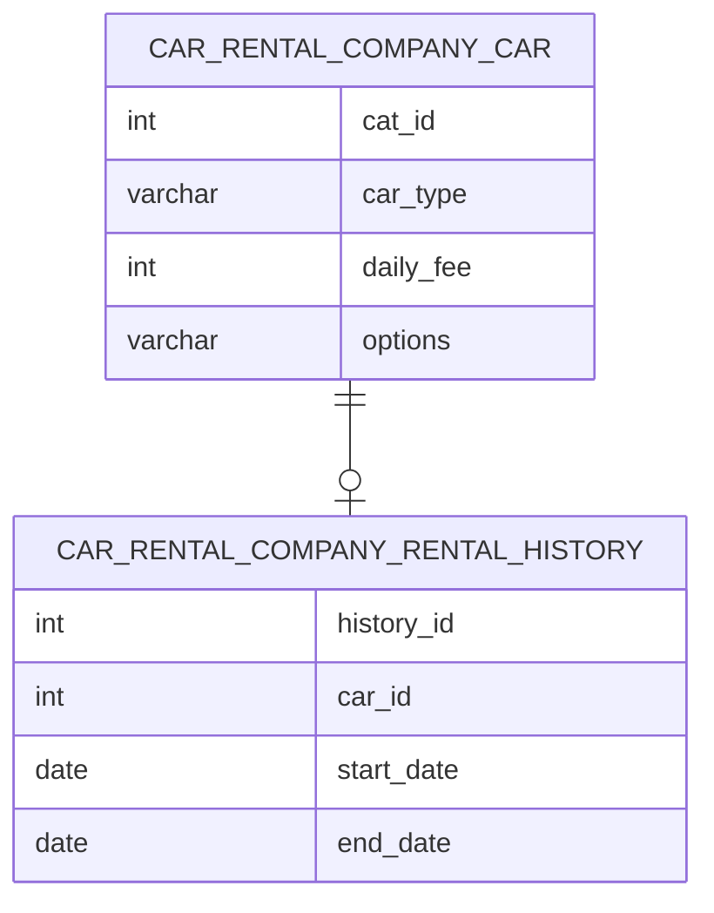

---
categories:
  - RDBMS
  - SQL-Practice
tags:
  - mysql
  - sql함수
mermaid: true
title: 프로그래머스 - car rental company 모음
permalink: /database/sql-practice/programmers-2
---



- 특정 옵션이 포함된 자동차 리스트 구하기 #like

```sql
SELECT *
from car_rental_company_car
where options like '%네비게이션%'
order by car_id desc;
```

- 평균 일일 대여 요금 구하기 #round #avg

```sql
SELECT round(avg(daily_fee)) as average_fee
from car_rental_company_car
group by car_type
having car_type='SUV';
```

- 자동차 종류 별 특정 옵션이 포함된 자동차 수 구하기

```sql
SELECT car_type, count(car_id) cars
from car_rental_company_car
where options like '%시트%'
group by car_type
order by car_type
```

- 대여 기록이 존재하는 자동차 리스트 구하기

```sql
SELECT distinct R.car_id
from car_rental_company_rental_history H join car_rental_company_car R
on R.car_id = H.car_id
where R.car_type='세단' and month(start_date) = 10
order by R.car_id desc;
```

- 자동차 평균 대여 기간 구하기 #datediff

```sql
select car_id, round(avg(datediff(end_date,start_date)+1),1) average_duration
from car_rental_company_rental_history
group by car_id
having avg(datediff(end_date,start_date)+1) >=7
order by average_duration desc, car_id desc;
```
